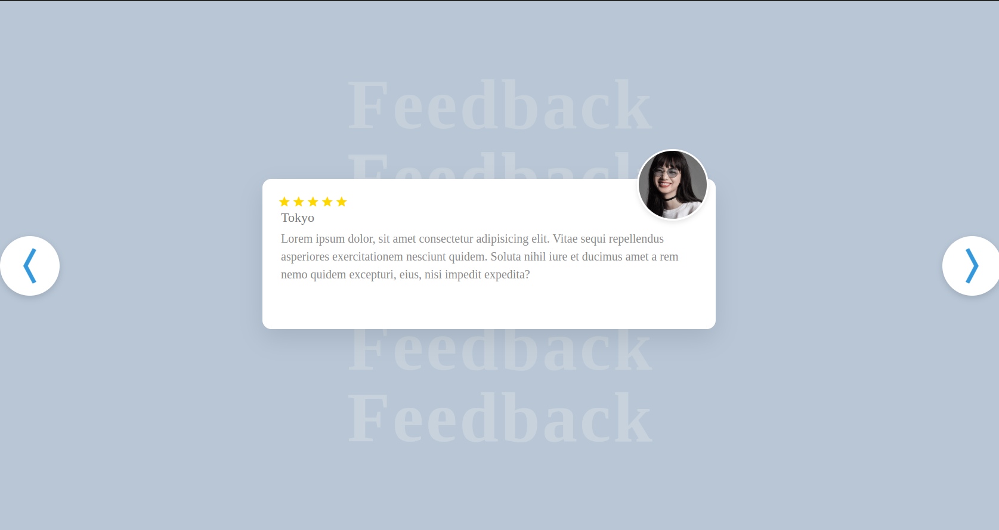
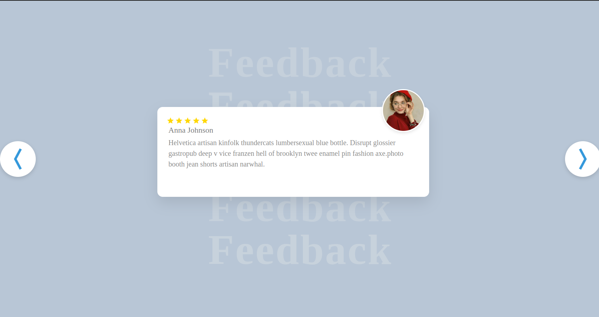

# 🌟 Company Review & Feedback Page

  

  
  
  

## ✨ Features

🎨 **Modern Design** - Clean, responsive interface that looks great on all devices  
⭐ **Star Ratings** - Interactive rating system for easy feedback collection    
📱 **Mobile Friendly** - Fully responsive design for desktop and mobile  

## 🚀 Demo

## 🏗️ Built With

- **HTML5** - Semantic markup structure
- **CSS3** - Modern styling with Flexbox/Grid
- **Vanilla JavaScript** - Interactive functionality

### Customization
- Modify colors in `css/style.css`
- Update company information in `index.html`
- Adjust animations and transitions as needed

## 📝 License

This project is licensed under the MIT License - see the [LICENSE](LICENSE) file for details.

## 🙏 Acknowledgments

- Thanks to all the developers who provided inspiration (pinterest)
- Icons by Font Awesome
- Fonts by Google Fonts
- Color palette inspiration from various design systems

## 🚀 Future Enhancements

- [ ] Backend integration for data persistence
- [ ] Admin dashboard for review management
- [ ] Multi-language support
- [ ] Dark mode toggle

---
---

